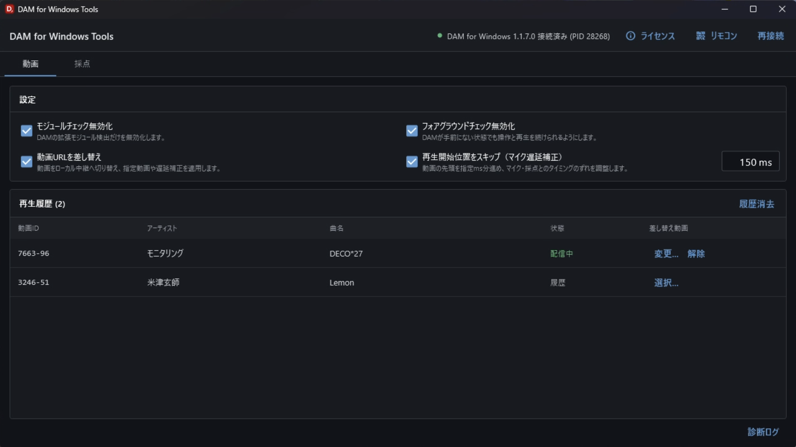
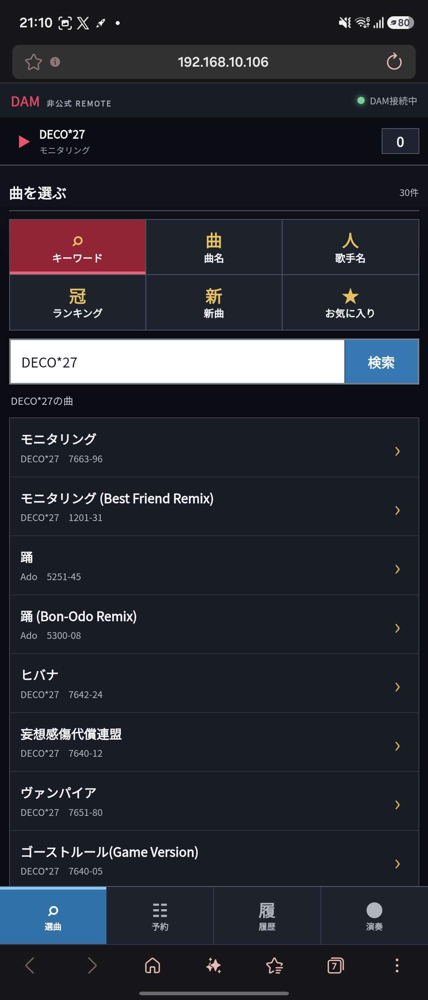
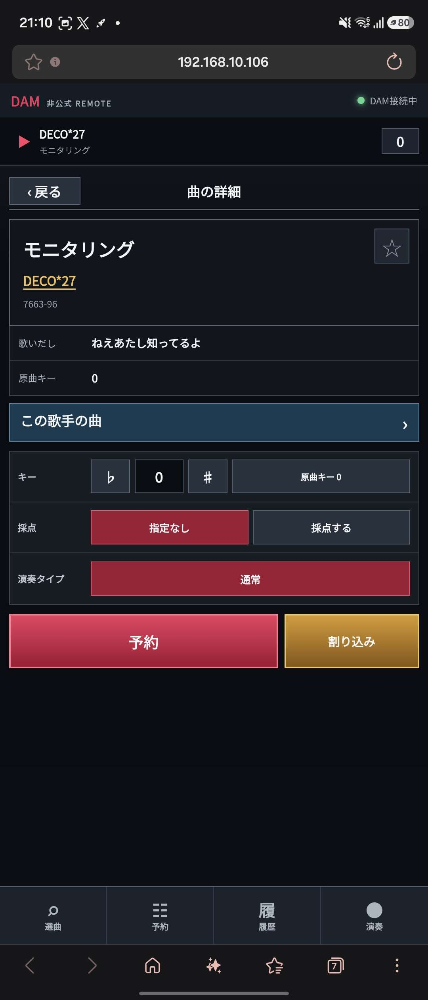
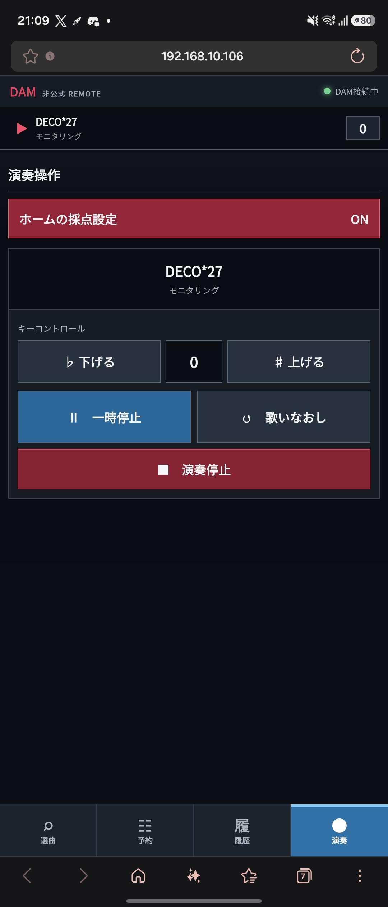
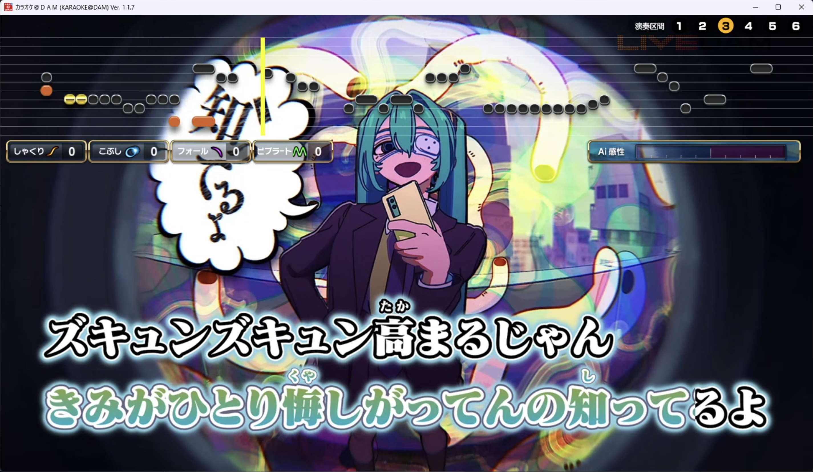

<!--
Project: DAM for Windows Tools
File: README.md
Copyright (c) 2026 nnnnnnn0090. All rights reserved.
Author: nnnnnnn0090
SPDX-License-Identifier: GPL-3.0-or-later
Created: 2026-08-22
-->

# DAM for Windows Tools

DAM for Windowsに、採点遅延補正・動画差し替え・表現技法表示・スマホリモコンを追加する非公式ツールです。

対象は **DAM for Windows 1.1.7.0**、OSは **Windows 10/11 x64** です。必要な実行環境は配布ZIPに入っているため、Flutter、Node.js、FFmpegなどを別途インストールする必要はありません。

> [!IMPORTANT]
> 本ツールは非公式です。第一興商株式会社およびDAMの権利者による公認・保証・サポートはありません。正規に利用できる家庭内環境で、サービスの規約と法令に従って使用してください。

## できること

- DAMの再生動画を、PCにある好きな動画へ差し替え
- マイク音声と画面のずれに合わせて、動画の開始位置をミリ秒単位で調整
- DAMの採点中に検出された、しゃくり・こぶし・フォール・ビブラートなどの歌唱表現を一覧表示
- 同じWi-Fiのスマホを、曲検索・予約・演奏操作ができるリモコンとして使用
- DAM本体の再生履歴、お気に入り、予約一覧をスマホから確認
- DAMが手前にない状態でも操作と再生を継続
- DAMの起動順に関係なく自動接続。DAMを再起動した場合も再接続
- 起動時とGUIの「更新」ボタンから新版を確認し、安全に自動更新・再起動

## スマホリモコン

PC側の「リモコン」を押すとQRコードが表示されます。同じWi-Fiに接続したスマホで読み取るだけで、ブラウザから利用できます。専用アプリのインストールは不要です。

| 曲を探す | 曲の詳細と予約 | 演奏中の操作 |
| --- | --- | --- |
|  |  |  |

リモコンでは次の操作ができます。

- キーワード、曲名、歌手名で検索
- ランキング、新曲、お気に入り、DAM本体の演奏履歴を表示
- 曲名、歌手名、曲番号、歌いだし、原曲キーを確認
- 同じ歌手の曲一覧を表示、お気に入りへ登録・解除
- キー、原曲キー、採点、演奏タイプを指定して予約
- 通常予約、割り込み予約
- 予約一覧の確認、順番の入れ替え、予約取り消し
- 一時停止・再開、歌いなおし、演奏停止
- 演奏中のキー変更、DAMホームと共通の採点設定のON/OFF

演奏タイプは、その曲が対応している「通常」「本人映像」「ガイドボーカル」だけを表示します。「採点：指定なし」はDAMホームの採点設定に従い、「採点する」はその予約で採点を有効にします。

## 動画差し替え

> [!CAUTION]
> 差し替え動画は、必ず **1280×720（720p）** で用意してください。1080pや4Kなど720pを超える動画を指定すると、DAMがクラッシュすることがあります。
>
> DAMの歌詞テロップは映像と一体化しています。**あらかじめ歌詞テロップが入った動画**を用意してください。

1. DAMで一度曲を再生します。
2. PC画面の再生履歴で、曲の右側にある「選択...」を押します。
3. 差し替えたい動画を選びます。
4. 次回から、その動画IDの曲に選択した動画が使われます。

対応形式は `mp4`、`mkv`、`mov`、`avi`、`webm`、`m2ts`、`ts` です。

選んだ動画は `DAMforWindowsToolsData/videos/` へコピーされ、再起動後も使用できます。「解除」を押すと、その曲の保存済み動画を削除します。自動配信される元動画は保存しません。

下の画像は、実際にテロップ入りのローカル動画へ差し替えて再生している画面です。動画側の歌詞テロップと、DAM側の音程バー・採点表示が同時に表示されています。

## 採点表現表示

PC画面の「採点」タブでは、採点中に検出された歌唱表現と回数をリアルタイムで確認できます。まだ検出されていない表現も薄く表示されるため、歌いながら全体を見渡せます。

表示は独立してON/OFFできます。回数は曲ごとに初期化され、採点終了後は結果を画面に残します。採点結果はファイルへ保存しません。

## PC側の設定

設定はそれぞれ個別にON/OFFできます。初期状態はすべてONです。

| 設定 | 用途 |
| --- | --- |
| モジュールチェック無効化 | DAMの拡張モジュール検出だけを無効にします。 |
| フォアグラウンドチェック無効化 | DAMが手前にない状態でも操作と再生を続けられるようにします。 |
| 動画URLを差し替え | 動画をローカル経由で再生し、指定動画や遅延補正を適用します。 |
| 再生開始位置をスキップ | 動画の先頭を指定した時間だけ進め、マイク・採点・映像のタイミングを合わせます。 |

スキップ値は `0～30000 ms`、初期値は `150 ms` です。変更は次に再生する曲から反映されます。

## インストールと起動

1. Releasesから `DAMforWindowsTools-*-win-x64.zip` をダウンロードします。
2. ZIPをデスクトップなどの書き込み可能な場所へ展開します。ZIPの中から直接起動したり、`Program Files`へ置いたりしないでください。
3. `DAMforWindowsTools.exe` を起動します。
4. DAMを起動します。先にDAMを起動していても構いません。
5. 画面右上が緑色の「接続済み」になれば準備完了です。

Windowsファイアウォールの確認が表示された場合は、スマホリモコンを使うために **プライベート ネットワークだけ** を許可してください。

## アップデート

起動時にGitHub Releasesの最新版を確認し、新しいバージョンがある場合は更新確認を表示します。右上の「更新」からいつでも再確認できます。

「更新する」を選ぶとWindows版ZIPを自動でダウンロードし、アプリ終了後にファイルを置き換えて再起動します。`DAMforWindowsToolsData/`の設定・履歴・差し替え動画には触れません。置き換えに失敗した場合は旧バージョンへ戻して起動します。

## データの保存と別PCへの移動

設定、再生履歴、選択した差し替え動画は、EXEの横に作られる `DAMforWindowsToolsData/` にまとまっています。AppDataやWindowsの一時フォルダには保存しません。

別PCへ移す場合は、配布フォルダと `DAMforWindowsToolsData/` を一緒にコピーしてください。差し替え動画は動画IDをファイル名として保存しているため、ドライブ文字や元の動画パスが変わっても割り当てを引き継げます。

保存するもの:

- チェックボックスと遅延補正の設定
- 動画ID・アーティスト名・曲名の再生履歴
- 利用者がGUIで選んだ差し替え動画

保存しないもの:

- 自動配信された元動画と上流URL
- 内部トークン、検出時刻、再生状態
- 採点結果
- 再生用に生成した一時HLS。終了時または次回起動時に削除します

## 困ったとき

- **「未対応のDAM」と表示される**: DAMのバージョンが異なります。本ツールは1.1.7.0専用です。
- **DAMへ接続できない**: 旧ツールや別のFridaスクリプトを終了し、「再接続」を押してください。
- **ローカル配信サーバーを起動できない**: `127.0.0.1:8765`を使用している旧サーバーなどを終了してください。
- **スマホでリモコンを開けない**: PCとスマホを同じWi-Fiへ接続し、Windowsファイアウォールで本ツールのプライベートネットワーク通信を許可してください。
- **リモコンが「利用不可」になる**: `8766`番ポートを使っている別のアプリを終了し、本ツールを再起動してください。
- **停止や一時停止のボタンが押せない**: DAMへ接続し、曲を演奏中か確認してください。演奏中だけ使用できる操作があります。
- **セキュリティソフトが警告する**: 本ツールはDAMへ接続するためにFridaを使用します。セキュリティ機能全体を無効にせず、公式Releasesから取得したファイルを使用してください。

## 対応バージョンと安全動作

- 対象ファイル: `DKKaraokeWindows.exe` 1.1.7.0
- 対象SHA-256: `C47E25AF4D5B96D299C17DFCCE464B5E84C5CCE0F81B3080CE7E5BEB37839099`
- 対応OS: Windows 10/11 x64

DAMの実行ファイルがこのハッシュと一致しない場合、本ツールは接続を中止し、変更を一切適用しません。終了時には適用した変更を元へ戻し、FFmpegとローカルサーバーを停止して一時データを削除します。

リモコンは家庭内LAN向けのHTTP通信です。公共Wi-Fi、職場、店舗、来客用Wi-Fiなど、第三者が参加できるネットワークでは使用しないでください。QRコードや接続URLも第三者へ共有しないでください。

## ライセンスと注意事項

自作部分は `GPL-3.0-or-later` です。スクリーンショット内のDAMの画面、商標、差し替え例の第三者コンテンツはGPLの対象ではなく、各権利者に帰属します。詳細は [LICENSE](LICENSE)、[LEGAL_NOTICE.md](LEGAL_NOTICE.md)、[THIRD_PARTY_NOTICES.md](THIRD_PARTY_NOTICES.md) を確認してください。アプリ右上の「ライセンス」からも、本体と同梱コンポーネントのライセンス全文を表示できます。

脆弱性に関する連絡は [SECURITY.md](SECURITY.md) の手順を使用し、公開Issueへ機密情報を投稿しないでください。

開発・ビルド方法は [CONTRIBUTING.md](CONTRIBUTING.md) と [RELEASING.md](RELEASING.md) に分離しています。

作者: `nnnnnnn0090`
